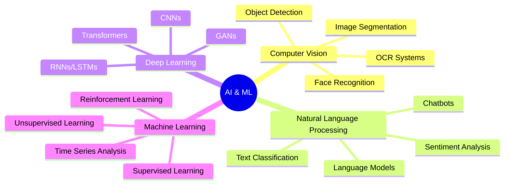
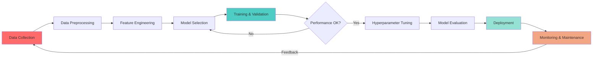

<div align="center">
  
</div>

<h3 align="center">🤖 Crafting AI Solutions That Transform Tomorrow</h3>

<p align="center">
  <a href="https://github.com/quangphamai">
    
  </a>
  <a href="https://linkedin.com/in/quangphamai">
    
  </a>
  <a href="mailto:quangphamai@gmail.com">
    
  </a>
  <a href="https://www.facebook.com/iamquangg.2004/">
    
  </a>
  
</p>

---

## 🎮 Play Tic-Tac-Toe with Me!

<div align="center">

**Click a cell to make your move! (You are ⭕)**

| | | |
|:---:|:---:|:---:|
| [⬜](https://github.com/quangphamai/quangphamai/issues/new?title=tictactoe%7Cmove%7C1&body=Just+push+%27Submit+new+issue%27.) | [⬜](https://github.com/quangphamai/quangphamai/issues/new?title=tictactoe%7Cmove%7C2&body=Just+push+%27Submit+new+issue%27.) | [⬜](https://github.com/quangphamai/quangphamai/issues/new?title=tictactoe%7Cmove%7C3&body=Just+push+%27Submit+new+issue%27.) |
| [⬜](https://github.com/quangphamai/quangphamai/issues/new?title=tictactoe%7Cmove%7C4&body=Just+push+%27Submit+new+issue%27.) | [⬜](https://github.com/quangphamai/quangphamai/issues/new?title=tictactoe%7Cmove%7C5&body=Just+push+%27Submit+new+issue%27.) | [⬜](https://github.com/quangphamai/quangphamai/issues/new?title=tictactoe%7Cmove%7C6&body=Just+push+%27Submit+new+issue%27.) |
| [⬜](https://github.com/quangphamai/quangphamai/issues/new?title=tictactoe%7Cmove%7C7&body=Just+push+%27Submit+new+issue%27.) | [⬜](https://github.com/quangphamai/quangphamai/issues/new?title=tictactoe%7Cmove%7C8&body=Just+push+%27Submit+new+issue%27.) | [⬜](https://github.com/quangphamai/quangphamai/issues/new?title=tictactoe%7Cmove%7C9&body=Just+push+%27Submit+new+issue%27.) |

**Last move:** First move - your turn!

</div>

---

## 🧑‍💻 About Me

```python
class AIEngineer:
    def __init__(self):
        self.name = "Pham Tran Minh Quang"
        self.role = "AI Engineer & Machine Learning Specialist"
        self.location = "Vietnam 🇻🇳"
        self.university = "Ho Chi Minh City University of Technology"
        self.education = "Computer Science & AI"
        
    def current_focus(self):
        return {
            "🔬 Research": ["Deep Learning", "Large Language Model", "NLP"],
            "📚 Learning": ["Transformer Architectures", "Reinforcement Learning"]
        }

me = AIEngineer()
```

<div align="center">

### 💡 "Intelligence is the ability to learn, adapt, and create value from data"

</div>

---

## 🧠 AI & Machine Learning Expertise

<div align="center">

### � Core AI/ML Technologies


### 🤖 AI Specializations



</div>

---

## 🛠️ Full Stack Development

<div align="center">

### 💻 Programming Languages


### 🎨 Mobile & Web Development


### 🗄️ Databases & Cloud


</div>

---

## 🚀 Featured AI Projects

<div align="center">

### 🚦 [Smart Traffic System](https://github.com/quangphamai)
**AI-Powered Traffic Optimization & Environmental Impact Reduction**

[](https://github.com/quangphamai)
[](https://github.com/quangphamai)
[](https://github.com/quangphamai)
[](https://github.com/quangphamai)

```
🎯 Key Features:
├── 🧠 ML-based route optimization using historical traffic data
├── 🌍 Real-time air quality monitoring with IoT sensors
├── 📊 Predictive analytics for traffic congestion
├── 🎁 Eco-reward system for sustainable transportation
└── 📱 Cross-platform mobile application
```

> **Impact:** Reducing traffic congestion by 30% and CO₂ emissions by 25% in pilot areas

<a href="https://github.com/quangphamai">
  
</a>

---

### 🧠 [AI Research Projects]
**Exploring Cutting-Edge Machine Learning Techniques**

```python
research_areas = {
    "Computer Vision": [
        "Real-time object detection for autonomous systems",
        "Image segmentation for medical diagnostics",
        "Facial emotion recognition"
    ],
    "NLP": [
        "Vietnamese language sentiment analysis",
        "Document classification with transformers",
        "Chatbot development with context awareness"
    ],
    "Optimization": [
        "Genetic algorithms for route planning",
        "Reinforcement learning for traffic management"
    ]
}
```

---

### 📊 [Data Science Portfolio]
**Transforming Raw Data into Actionable Insights**

- 📈 Time series forecasting for demand prediction
- 🔍 Anomaly detection in IoT sensor networks
- 🎯 Customer segmentation using clustering algorithms
- 📉 Statistical analysis and A/B testing frameworks

</div>

---

## 📊 GitHub Analytics

<div align="center">
  
  
</div>

<div align="center">
  
</div>

<div align="center">
  
</div>

---

## 🏆 Achievements & Recognition

<div align="center">
  
</div>

<div align="center">

### 🎯 2024 Milestones

| Achievement | Status | Impact |
|-------------|--------|--------|
| 🚀 Smart Traffic System Launch | 🟢 In Progress | Reducing urban congestion |
| 🤖 AI Research Papers | � Research Phase | Contributing to AI community |
| 📱 Flutter Clean Architecture | ✅ Mastered | Production-ready apps |
| 🌱 Green Tech Contributions | ✅ Ongoing | Environmental impact |
| 📝 Technical Blogging | 🟢 Active | Knowledge sharing |

</div>

---

## 💻 Coding Activity

<div align="center">

```text
Python         ████████████████░░░░   80%  🥇 Primary Language
Dart           ██████████░░░░░░░░░░   50%  📱 Mobile Development
JavaScript     ████████░░░░░░░░░░░░   40%  🌐 Web Development
TypeScript     ██████░░░░░░░░░░░░░░   30%  ⚡ Type-safe Frontend
SQL            ████░░░░░░░░░░░░░░░░   20%  🗄️ Database Management
```

</div>

---

## 🎯 Current Focus & Goals

```yaml
Current Sprint (Q4 2024):
  🚀 Primary Project:
    - Smart Traffic System MVP deployment
    - AI model optimization for real-time inference
    - Integration with city IoT infrastructure
  
  📚 Learning & Research:
    - Advanced Transformer architectures (BERT, GPT variants)
    - Reinforcement Learning for autonomous systems
    - MLOps & model deployment at scale
    - Edge AI & TinyML for resource-constrained devices
  
  🌟 Community Engagement:
    - Contributing to open-source ML libraries
    - Writing technical blogs on AI/ML topics
    - Mentoring junior developers in AI
    - Speaking at tech meetups

2024 Vision:
  - ✅ Master deep learning frameworks
  - ✅ Build production-ready AI systems
  - ✅ Contribute to green tech solutions
  - 🔄 Publish AI research papers
  - � Expand ML portfolio with diverse projects
```

---

## 🧪 AI Model Development Pipeline

<div align="center">



</div>

---

## 📚 Technical Blog & Knowledge Sharing

<div align="center">

| Topic | Description | Link |
|-------|-------------|------|
| 🧠 Deep Learning Fundamentals | Understanding neural networks from scratch | Coming Soon |
| 🚗 Traffic Prediction with ML | Time series analysis for urban planning | Coming Soon |
| 📱 Flutter + AI Integration | Building intelligent mobile apps | Coming Soon |
| 🌍 AI for Sustainability | Using ML to combat climate change | Coming Soon |

</div>

---

## 🤝 Let's Collaborate!

<div align="center">

I'm always excited to collaborate on:
- 🤖 **AI/ML Projects**: Computer Vision, NLP, Deep Learning
- 🌱 **Green Tech**: Environmental and sustainability solutions
- 📱 **Mobile AI**: On-device ML and intelligent apps
- 🚀 **Startup Ideas**: Tech-driven innovation
- 📖 **Open Source**: Contributing to the community

### 💌 Reach Out!

[](https://linkedin.com/in/quangphamai)
[](mailto:quangphamai@example.com)
[](https://github.com/quangphamai)
[](https://twitter.com/quangphamai)

</div>

---

<div align="center">

### 💭 Daily Inspiration


---

### � Contribution Snake


---


**⚡ "In AI we trust, in code we build, in innovation we thrive" ⚡**


</div>
